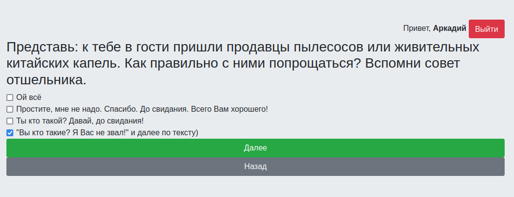
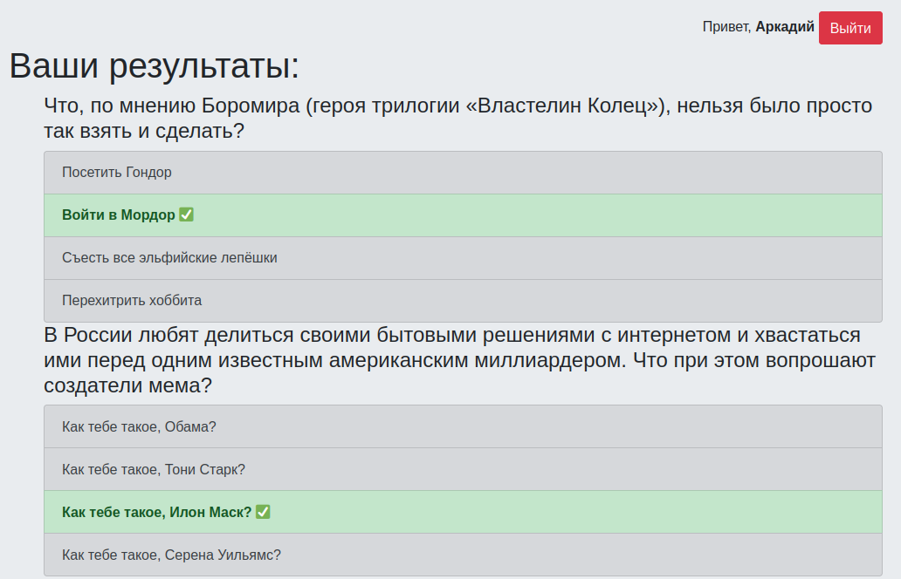

# testing_system

Веб приложение для создания/проведения/проверки тестов.

Написано на `Python3` с применением фреймворка `Django`

## Возможности:

1. Регистрация/авторизация пользователей в системе;
2. Возможность решать тесты;
3. Возможность дорешать в другое время _(все пользователя ответы сохраняются на сервере)_;
4. Просмотр результатов тестирования;
5. Создание тестов через админ панель;
6. Изменение вопросов/ответов в любое время;
7. Группировка тестов по тестовым наборам _(тегам)_;
8. Детальный просмотр результатов тестирования через админ панель с множеством фильтров;

## Сборка:

### Docker:

1. `git clone https://github.com/artempelevin/testing_system`
2. `cd testing_system`
3. `docker-compose build`
4. `docker-compose run --rm testing_system python3 manage.py migrate`
5. `docker-compose run --rm testing_system python3 manage.py loaddata example_data.json`
6. `docker-compose up`

### Без Docker:

1. `git clone https://github.com/artempelevin/testing_system`
2. `cd testing_system`
3. `python3 -m venv venv`
4. `source venv/bin/activate`
5. `pip install -r requirements.txt`
6. `python manage.py migrate`
7. `python3 manage.py loaddata example_data.json`
8. `python manage.py runserver`

## Как пользоваться?

* http://127.0.0.1:8000/ - адрес клиентской части приложения;
* http://127.0.0.1:8000/admin - адрес админ панели;
* По умолчанию создан 1 суперюзер _(имя пользователя: `test`, пароль: `test`)_;

_**Рис1.**_ _Пример выполнения теста_

_**Рис2.**_ _Просмотр результатов тестирования_

_**Рис3.**_ _Просмотр результатов тестирования через админ панель_

_**Рис4.**_ _Редактирование теста через админ панель_